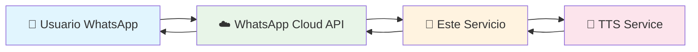
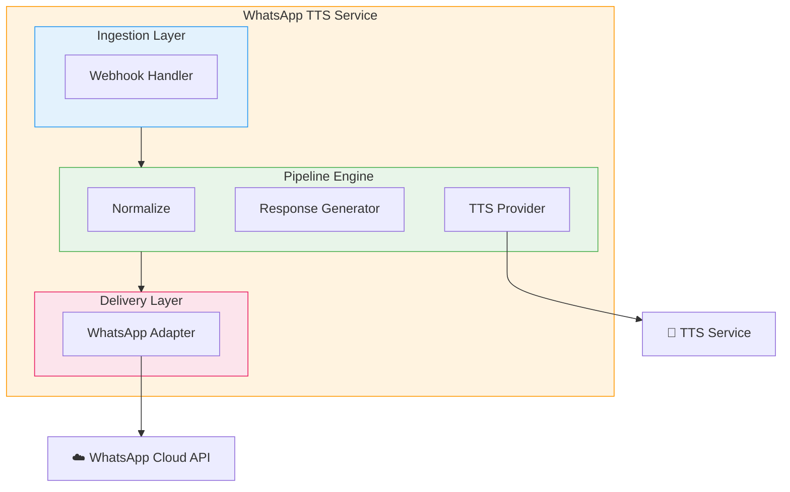
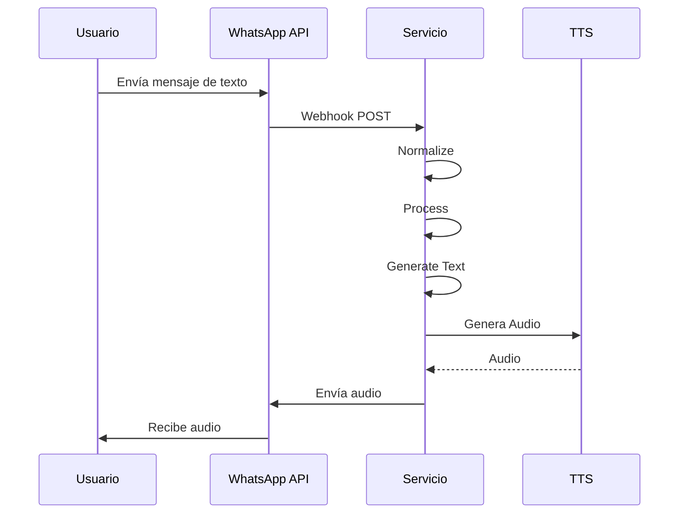

# WhatsApp TTS Service

Servicio backend en Go que integra WhatsApp Cloud API con un servicio Text-to-Speech (TTS). El sistema recibe mensajes de texto de WhatsApp, los procesa, genera audio mediante TTS, y envía el audio de vuelta al usuario.

## Propósito del Sistema

- Receibir mensajes entrantes desde WhatsApp a través de webhooks
- Procesar el contenido textual del mensaje
- Generar una respuesta en audio mediante TTS
- Enviar el audio de vuelta al usuario vía WhatsApp Cloud API

## Límites del Sistema

El sistema opera como un servicio intermediario (middleware) entre dos sistemas externos:



### INPUT
- Webhooks HTTP POST de WhatsApp Cloud API
- Autenticación mediante verify_token para verificación
- Payloads JSON con mensajes de texto

### OUTPUT
- Mensajes de audio (audio/aac) enviados a usuarios de WhatsApp
- Respuestas HTTP 200 OK al webhook de WhatsApp

## Sistemas Externos

### WhatsApp Cloud API

| 属性 | Valor |
|------|-------|
| Proveedor | Meta (Facebook) |
| Protocolo | HTTPS REST API |
| Receive | Webhooks de mensajes entrantes |
| Send | Envío de mensajes de audio |

**Endpoints relevantes**:
- `POST /webhook` - Receción de eventos
- `POST /{phone_number_id}/messages` - Envío de mensajes

**Configuración requerida**:
- Phone Number ID
- WhatsApp Business Account ID
- Access Token
- Webhook Verification Token

### TTS Service (StyleTTS or compatible)

| 属性 | Valor |
|------|-------|
| Proveedor | StyleTTS 2 o compatible |
| Protocolo | HTTP/REST o gRPC |
| Funciones | Conversión de texto a audio |

**Input**: Texto a convertir, Voz/voice ID, Idioma
**Output**: Audio binary (formato: audio/aac, audio/mp3, audio/wav) o audio URL

## Arquitectura de Alto Nivel



### Componentes Principales

1. **Webhook Handler**: Receibe y verifica webhooks de WhatsApp
2. **Ingestion Layer**: Normaliza mensajes entrantes al modelo interno
3. **Pipeline Engine**: Orquesta el procesamiento de mensajes
4. **Response Generator**: Genera texto de respuesta (placeholder inicial)
5. **TTS Provider**: Interface para servicios TTS
6. **WhatsApp Adapter**: Envía mensajes de audio a WhatsApp

## Flujo de Datos



## Estado Actual

| Componente | Estado | Notas |
|------------|--------|-------|
| Webhook Handler | ✅ Listo | GET/POST /webhook |
| WhatsApp Client | ✅ Listo | SendText, SendAudio |
| Pipeline | ✅ Listo | Stage interface |
| Domain Models | ✅ Listo | UserMessage, ResponseMessage, AudioAsset |
| Logger | ✅ Listo | Interfaz con StdLogger |
| TTS Provider | ⚠️ Stub | Solo genera datos dummy |
| Audio Processing | ❌ Pendiente | No hay conversión |
| Delivery Stage | ⚠️ Stub | No entrega audio real |
| Métricas Prometheus | ❌ Pendiente | No implementado |
| Health Check | ❌ Pendiente | No implementado |

## Constraints

- Solo mensajes de texto entrantes (v1)
- Respuesta placeholder inicial: "Message received. Generating audio response."
- Diseño debe permitir extensión para pasos adicionales futuros
- Soporte para procesamiento síncrono y asíncrono

## Estructura del Proyecto

```
whatsapp-tts/
├── cmd/server/              # Entry point
├── internal/
│   ├── domain/            # Modelos de dominio
│   ├── pipeline/           # Motor de pipeline
│   │   └── stages/         # 5 stages
│   ├── webhook/            # HTTP handlers
│   ├── adapters/
│   │   └── whatsapp/       # Cliente WhatsApp
│   ├── observability/      # Logger
│   └── config/            # Configuración
├── openspec/
│   ├── specs/              # Specs implementadas
│   └── changes/            # Cambios pendientes
└── docs/                   # Documentación de referencia
```

## SDD (Spec-Driven Development) con OpenSpec

Este proyecto usa **OpenSpec** para gestionar especificaciones y cambios.

### Comandos

```bash
# Ver estado de cambios
openspec status

# Crear nuevo cambio
openspec new change "<nombre>"

# Aplicar cambio (implementar tareas)
openspec apply --change "<nombre>"
```

### Specs Disponibles

Las specs están en `openspec/specs/`:

- `domain-models/` - UserMessage, ResponseMessage, AudioAsset
- `pipeline-engine/` - Stage, Pipeline interfaces
- `pipeline-stages/` - 5 stages del pipeline
- `webhook-handler/` - GET/POST handlers
- `whatsapp-client/` - Client con SendText/SendAudio
- `observability/` - Logger interface
- `tts-provider/` - Interfaz TTS (pendiente)
- `error-handling/` - Manejo de errores (pendiente)

Ver [AGENTS.md](./AGENTS.md) para información sobre skills disponibles.

## Configuración

El servicio usa variables de entorno (ver `.env.example`):

```env
WHATSAPP_PHONE_NUMBER_ID=
WHATSAPP_ACCESS_TOKEN=
WHATSAPP_API_URL=https://graph.facebook.com
WHATSAPP_VERIFY_TOKEN=
TTS_ENDPOINT=
TTS_API_KEY=
LOG_LEVEL=info
```

## Desarrollo

```bash
# Ejecutar tests
go test ./...

# Build
go build -o bin/server ./cmd/server

# Run
go run ./cmd/server
```

## Notas de Implementación

- El sistema debe validar el token de verificación de WhatsApp
- Debe manejar el handshake inicial del webhook
- Debe extraer el `phone_number_id` del payload para respuestas
- Debe almacenar el `from` del usuario para envío de respuesta
