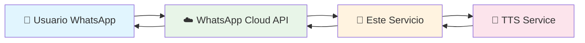
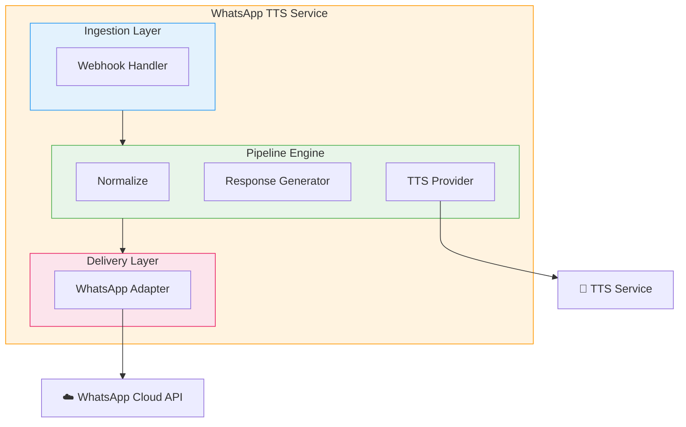
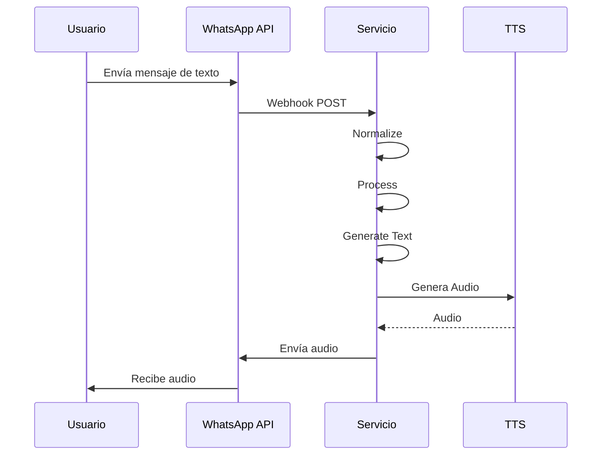

# SPEC-001: System Overview

## 1. System Purpose

El sistema es un servicio backend desarrollado en Go que integra la WhatsApp Cloud API con un servicio de Text-to-Speech (TTS). Su función principal es:

- Receibir mensajes entrantes desde WhatsApp a través de webhooks
- Procesar el contenido textual del mensaje
- Generar una respuesta en audio mediante TTS
- Enviar el audio de vuelta al usuario vía WhatsApp Cloud API

## 2. System Boundaries

El sistema opera como un servicio intermediario (middleware) entre dos sistemas externos:

### INPUT
- Webhooks HTTP POST de WhatsApp Cloud API
- Autenticación mediante verify_token para verificación
- Payloads JSON con mensajes de texto

### OUTPUT
- Mensajes de audio (audio/aac) enviados a usuarios de WhatsApp
- Respuestas HTTP 200 OK al webhook de WhatsApp

## 3. External Systems

### 3.1 WhatsApp Cloud API

**Proveedor**: Meta (Facebook)
**Protocolo**: HTTPS REST API
**Funciones**:
- Receive: Webhooks de mensajes entrantes
- Send: Envío de mensajes de audio

**Endpoints relevantes**:
- `POST /webhook` - Receción de eventos
- `POST /{phone_number_id}/messages` - Envío de mensajes

**Configuración requerida**:
- Phone Number ID
- WhatsApp Business Account ID
- Access Token
- Webhook Verification Token

### 3.2 TTS Service (StyleTTS or compatible)

**Proveedor**: StyleTTS 2 o compatible
**Protocolo**: HTTP/REST o gRPC
**Funciones**:
- Conversión de texto a audio
- Generación de archivos de audio

**Input**:
- Texto a convertir
- Voz/voice ID
- Idioma

**Output**:
- Audio binary (formato: audio/aac, audio/mp3, audio/wav)
- O audio URL para descarga

## 4. High-Level Architecture

### Componentes Principales

1. **Webhook Handler**: Receibe y verifica webhooks de WhatsApp
2. **Ingestion Layer**: Normaliza mensajes entrantes al modelo interno
3. **Pipeline Engine**: Orquesta el procesamiento de mensajes
4. **Response Generator**: Genera texto de respuesta (placeholder inicial)
5. **TTS Provider**: Interface para servicios TTS
6. **WhatsApp Adapter**: Envía mensajes de audio a WhatsApp

## 5. Flujo de Datos

## 6.约束 (Constraints)

- Solo mensajes de texto entrantes (v1)
- Respuesta placeholder inicial: "Message received. Generating audio response."
- Diseño debe permitir extensión para pasos adicionales futuros
- Soporte para procesamiento síncrono y asíncrono

## 7. Notas de Implementación

- El sistema debe validar el token de verificación de WhatsApp
- Debe manejar el handshake inicial del webhook
- Debe extraer el `phone_number_id` del payload para respuestas
- Debe almacenar el `from` del usuario para envío de respuesta