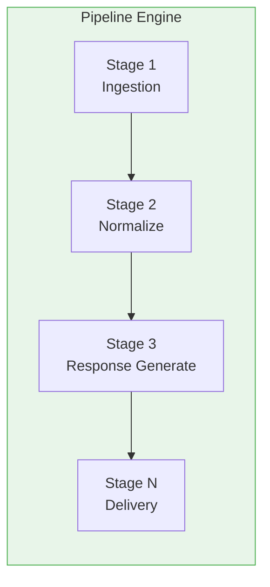
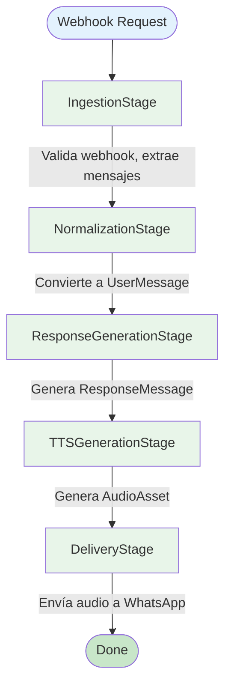

# SPEC-004: Processing Pipeline Specification

## 1. Visión General

El pipeline de procesamiento es el núcleo del sistema que orquesta el flujo de un mensaje desde su recepción hasta la respuesta final. Está diseñado como una cadena de responsabilidad (Chain of Responsibility) que permite insertar nuevos pasos sin modificar los existentes.

## 2. Arquitectura del Pipeline



## 3. Stages del Pipeline (v1)

### Stage 1: Event Ingestion
- **Input**: HTTP Request (Webhook)
- **Output**: Raw message payload
- **Responsabilidad**: Validar webhook, extraer payload

### Stage 2: Message Normalization
- **Input**: Raw payload
- **Output**: UserMessage domain model
- **Responsabilidad**: Convertir payload externo a modelo interno

### Stage 3: Processing Pipeline
- **Input**: Normalized message
- **Output**: Processed message with context
- **Responsabilidad**: Ejecutar lógica de negocio (placeholder v1)

### Stage 4: Response Generation
- **Input**: Processed message
- **Output**: ResponseMessage with text
- **Responsabilidad**: Generar texto de respuesta

### Stage 5: TTS Generation
- **Input**: Response text
- **Output**: AudioAsset (audio binary)
- **Responsabilidad**: Convertir texto a audio

### Stage 6: Response Delivery
- **Input**: AudioAsset + metadata
- **Output**: Confirmation from external API
- **Responsabilidad**: Enviar audio al usuario

## 4. Contratos de Stage

### 4.1 Interfaz Base de Stage

```go
package pipeline

import (
    "context"
    "errors"
)

// Stage representa una etapa del pipeline.
type Stage interface {
    // Name retorna el nombre de la etapa.
    Name() string
    
    // Process ejecuta la lógica de la etapa.
    // Retorna el contexto modificado y un error si falla.
    Process(ctx context.Context, input interface{}) (interface{}, error)
    
    // CanProcess determina si esta etapa puede procesar el input.
    CanProcess(input interface{}) bool
}
```

### 4.2 Pipeline Context

```go
package pipeline

import "github.com/whatsapp-tts/internal/domain"

// PipelineContext contiene el contexto compartido entre etapas.
type PipelineContext struct {
    // RequestID es el ID de correlación de la solicitud.
    RequestID string
    
    // TraceID para trazabilidad.
    TraceID string
    
    // Message es el mensaje normalizado.
    Message *domain.UserMessage
    
    // Response es la respuesta generada.
    Response *domain.ResponseMessage
    
    // Audio es el audio generado.
    Audio *domain.AudioAsset
    
    // Errors acumula errores durante el pipeline.
    Errors []PipelineError
    
    // Metadata adicional del pipeline.
    Metadata map[string]interface{}
}

// PipelineError representa un error en el pipeline.
type PipelineError struct {
    Stage   string
    Err     error
    IsFatal bool
}
```

### 4.3 Pipeline Interface

```go
package pipeline

import "context"

// Pipeline ejecuta el flujo completo de procesamiento.
type Pipeline interface {
    // Execute ejecuta el pipeline con el input dado.
    Execute(ctx context.Context, input interface{}) (*PipelineContext, error)
    
    // RegisterStage registra una etapa en el pipeline.
    RegisterStage(stage Stage)
    
    // Stages retorna las etapas registradas.
    Stages() []Stage
}
```

### 4.4 Stage Interfaces Específicas

```go
package pipeline

import "github.com/whatsapp-tts/internal/domain"

// EventReceiver recibe eventos HTTP del webhook.
type EventReceiver interface {
    Receive(ctx context.Context, request interface{}) (RawEvent, error)
}

type RawEvent struct {
    Payload   []byte
    Headers   map[string]string
    Method    string
}

// MessageNormalizer normaliza eventos raw a UserMessage.
type MessageNormalizer interface {
    Normalize(ctx context.Context, event RawEvent) (*domain.UserMessage, error)
}

// MessageProcessor procesa el mensaje y genera una respuesta.
type MessageProcessor interface {
    Process(ctx context.Context, message *domain.UserMessage) (*domain.ResponseMessage, error)
}

// TTSEngine convierte texto a audio.
type TTSEngine interface {
    GenerateAudio(ctx context.Context, text string) (*domain.AudioAsset, error)
}

// DeliveryAdapter entrega la respuesta al usuario.
type DeliveryAdapter interface {
    Deliver(ctx context.Context, response *domain.ResponseMessage, audio *domain.AudioAsset) error
}
```

### 4.5 Errores del Pipeline

```go
package pipeline

import "errors"

var (
    ErrInvalidInput       = errors.New("invalid input for stage")
    ErrUnknownStageType   = errors.New("unknown stage type")
    ErrPipelineFailed     = errors.New("pipeline execution failed")
    ErrStageNotRegistered = errors.New("stage not registered")
)
```

## 5. Motor del Pipeline

```go
type Pipeline struct {
    stages []Stage
}

func NewPipeline(stages ...Stage) *Pipeline {
    return &Pipeline{stages: stages}
}

func (p *Pipeline) Execute(ctx context.Context, input interface{}) (*PipelineContext, error) {
    pipelineCtx := &PipelineContext{
        RequestID: generateRequestID(),
        TraceID:   generateTraceID(),
        Metadata:  make(map[string]interface{}),
    }
    
    currentInput := input
    
    for _, stage := range p.stages {
        if !stage.CanProcess(currentInput) {
            return nil, fmt.Errorf("stage %s cannot process input", stage.Name())
        }
        
        output, err := stage.Process(ctx, currentInput)
        if err != nil {
            pipelineCtx.Errors = append(pipelineCtx.Errors, PipelineError{
                Stage:   stage.Name(),
                Err:     err,
                IsFatal: true,
            })
            return pipelineCtx, err
        }
        
        currentInput = output
    }
    
    return pipelineCtx, nil
}
```

## 6. Flujo de Ejecución



## 7. Manejo de Errores

- Cada stage puede retornar un error
- Errores fatales detienen el pipeline inmediatamente
- Errores no-fatales se acumulan en `PipelineContext.Errors`
- El pipeline retorna el contexto con errores para debugging
- Para estructura de errores detallada ver CONTRACT-008-Error-Model.md